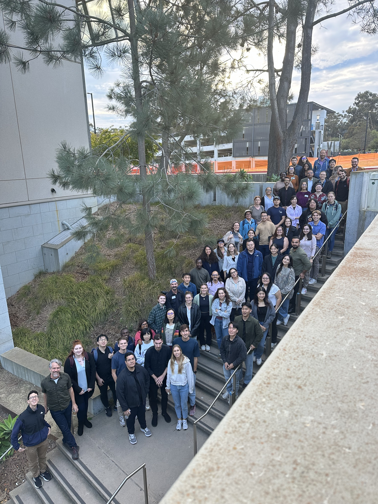
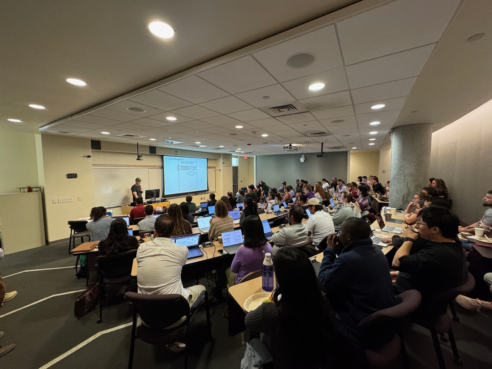
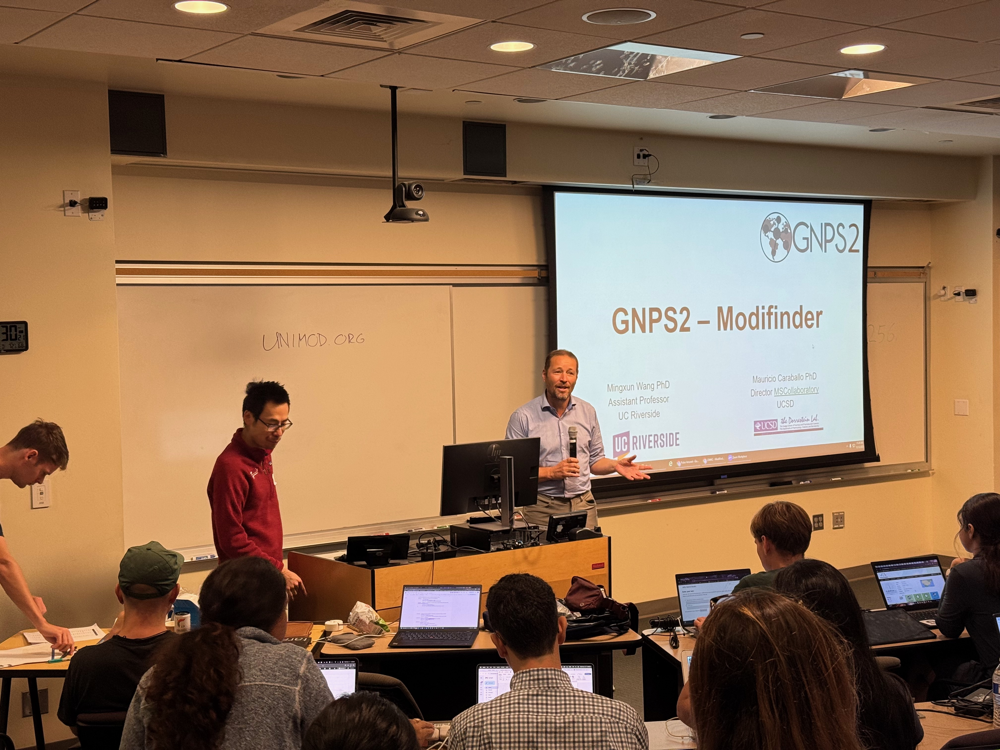
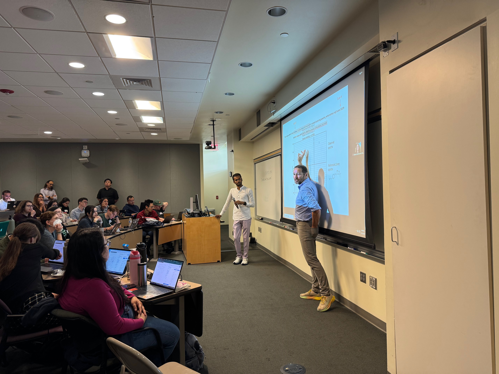
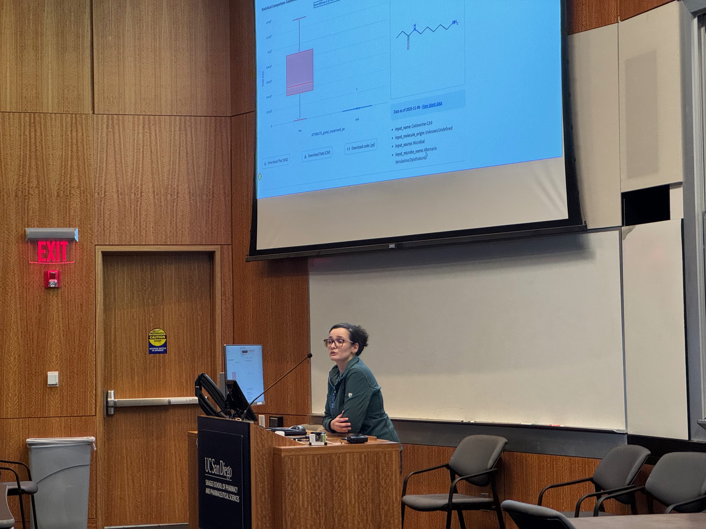

## CMMC workshops and training

Workshops are being provided to enable grantees and the large scientific community to get familiarized with the tools developed as part of these efforts.
Check out below the workshops that were already organized!

- **Understanding Microbial Metabolites and Responses Using LC-MS-Based Untargeted Metabolomics**

  **When:** November 12-13, 2025  
  **Where:** University of California San Diego

The workshop drew 70 registrants from nearly 40 institutions, including UC campuses, medical schools, research institutes, and universities across the U.S. The attendance reflected a strong mix of CMMC-affiliated and external participants, highlighting the broad reach of the event.

  

   
  
  
  
  

- **Network Enrichment analysis and CMMC Deposition workflow workshop  - October 31st, 2023**
<iframe width="600" height="350" src="https://www.youtube.com/embed/EcEq1uVP8TQ"> </iframe>

- **microbeMASST workshop  - June 5th, 2023**
<iframe width="600" height="350" src="https://www.youtube.com/embed/aB15wHR9kbY"> </iframe>

- **Classical Molecular Networking workshop - May 30th, 2023**
<iframe width="600" height="350" src="https://www.youtube.com/embed/wUrsqmAFEys"> </iframe>
